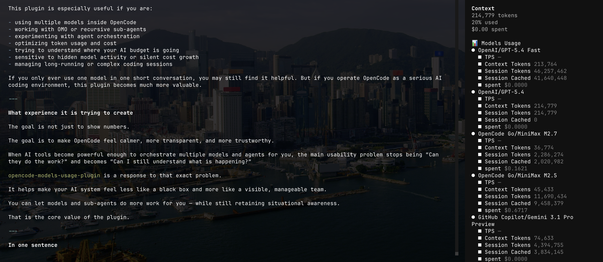

# opencode-models-usage-plugin

**언어:** [English](./README.md) | [简体中文](./README.zh-CN.md) | [日本語](./README.ja.md) | 한국어

**이제 OpenCode 사이드바에서 “내 AI 모델 팀이 지금 무엇을 하고 있는지”를 실시간으로 볼 수 있습니다.**

여러 모델과 다층 Agent, 그리고 OMO 하위 세션까지 함께 사용하며 Coding 할 때 이런 불안을 느낀 적이 있지 않나요?

- 지금 실제로 어느 모델이 출력 중인지? 속도는 빠른지 느린지?
- 이미 얼마나 많은 tokens 를 소비했는지? 하위 Agent 가 다른 모델을 몰래 호출하고 있지는 않은지?
- 캐시 적중은 얼마나 잘 되고 있는지? 지금 coding plan 이 얼마나 더 버틸 수 있는지?
- 비용이 갑자기 크게 늘어나지는 않을지?

**이제 그런 불안에서 훨씬 자유로워질 수 있습니다.**

`opencode-models-usage-plugin` 은 현재 세션 트리 전체에서 모델 사용 현황을 투명하게 보여줍니다. 무슨 일이 벌어지고 있는지 이해한 상태로 AI 팀을 더 자신 있게 운용할 수 있습니다.



## 무엇을 보여주나요?

OpenCode 사이드바에서 현재 세션 트리(재귀적인 하위 세션 포함)에 등장한 각 모델의 사용 현황을 **provider/model** 기준으로 집계하여 보여줍니다.

- **Live TPS**: 스트리밍 출력 중인 현재 tokens per second. idle 상태가 되면 `—` 로 돌아갑니다
- **Context Tokens**: 해당 모델의 가장 최근 응답에 해당하는 token 총량
- **Session Tokens**: 현재 세션에서 해당 모델이 누적 소비한 token 총량
- **Session Cached**: 현재 세션에서 해당 모델이 누적 캐시 적중한 token 총량
- **Total Cost**: 지금까지 발생한 누적 비용 (`spent $x.xxxx` 형식)

어떤 모델이 현재 활발히 출력 중이면 그 모델 이름이 **하이라이트**되어, 지금 누가 일을 하고 있는지 바로 알 수 있습니다.

## 사이드바 예시

```text
📊 Models Usage
● OpenAI/GPT-5.4 Fast
  ■ TPS 23.1
  ■ Context Tokens 12,345
  ■ Session Tokens 84,163
  ■ Session Cached 81,792
  ■ spent $0.0000

● Google/Gemini-2.5-Pro
  ■ TPS —
  ■ Context Tokens 8,942
  ■ Session Tokens 45,672
  ■ Session Cached 32,100
  ■ spent $0.0123
```

## 왜 중요한가요?

- **완전한 투명성**: OMO 하위 Agent 와 재귀 호출에서 생긴 사용량까지 자동으로 집계되어 숨겨진 비용이 없어집니다
- **실시간 통제력**: Live TPS, 캐시 적중, 누적 비용을 한눈에 확인할 수 있습니다
- **더 나은 판단**: 느린 모델과 캐시 효율이 좋은 모델을 빠르게 구분해 전략을 조정할 수 있습니다
- **덜 불안한 Coding**: 갑작스러운 비용 증가나 token 고갈을 덜 걱정하고 개발에 집중할 수 있습니다

## 요구 사항

- OpenCode `>= 1.4.3`

## 설치 방법

### 방법 1: 전역 TUI 설정 파일을 수동으로 수정하기 (처음엔 이 방법 추천)

다음 전역 설정 파일을 열거나 새로 만드세요.

```text
~/.config/opencode/tui.json
```

아래 내용을 추가하세요.

```json
{
  "$schema": "https://opencode.ai/tui.json",
  "plugin": [
    "opencode-models-usage-plugin/tui"
  ],
  "plugin_enabled": {
    "local:session-model-usage": true
  }
}
```

저장한 뒤 OpenCode 를 재시작하면 npm 을 통해 자동으로 설치됩니다.

### 방법 2: CLI 한 줄로 설치하기

```bash
opencode plugin opencode-models-usage-plugin/tui --global
```

이 명령은 플러그인을 설치하고 전역 설정도 자동으로 갱신합니다.

## 기술 메모

- 데이터는 provider/model label 기준으로 엄격하게 집계됩니다
- OMO 하위 Agent 와 재귀적인 하위 세션을 완전히 지원합니다
- TPS 는 live-only 이며, 스트리밍 중에만 갱신되고 idle 상태가 되면 `—` 로 돌아갑니다
- Context Tokens 는 가장 최근 응답의 token 총량을 나타냅니다
- Session Tokens 와 Session Cached 는 현재 세션 트리 전체의 누적값입니다

## 패키지 정보

- npm: `opencode-models-usage-plugin`
- 현재 버전: `0.1.0`

## License

`Apache-2.0`

설치 후 바로 한 번 써 보세요. 사이드바에 모든 모델의 상태가 선명하게 정리되어 보이는 순간, AI Coding 이 훨씬 더 차분하고 통제 가능하게 느껴질 것입니다.
